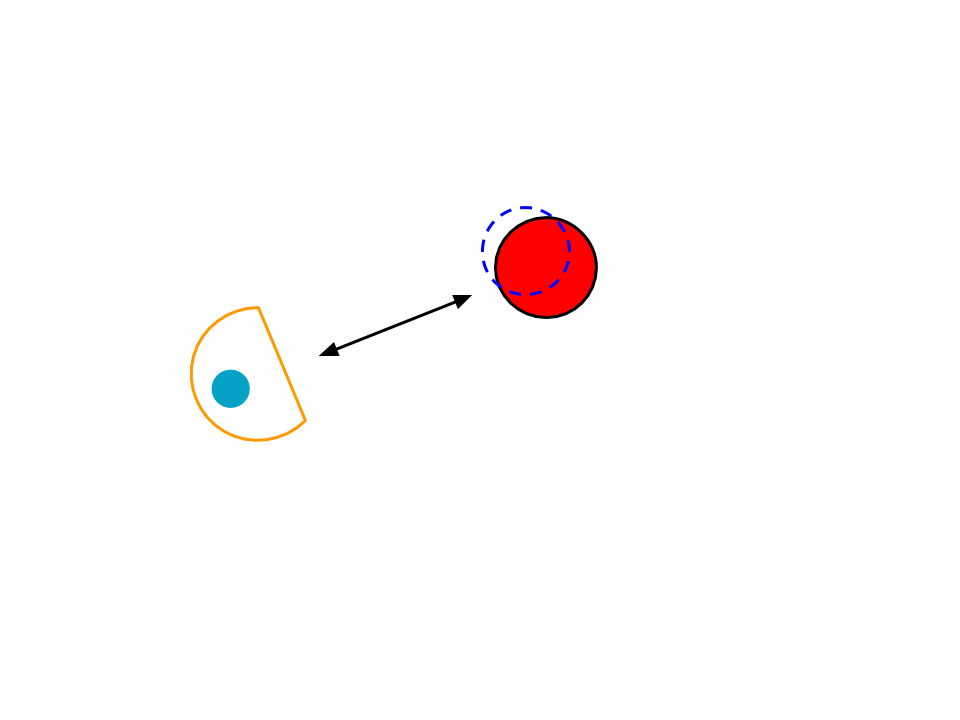
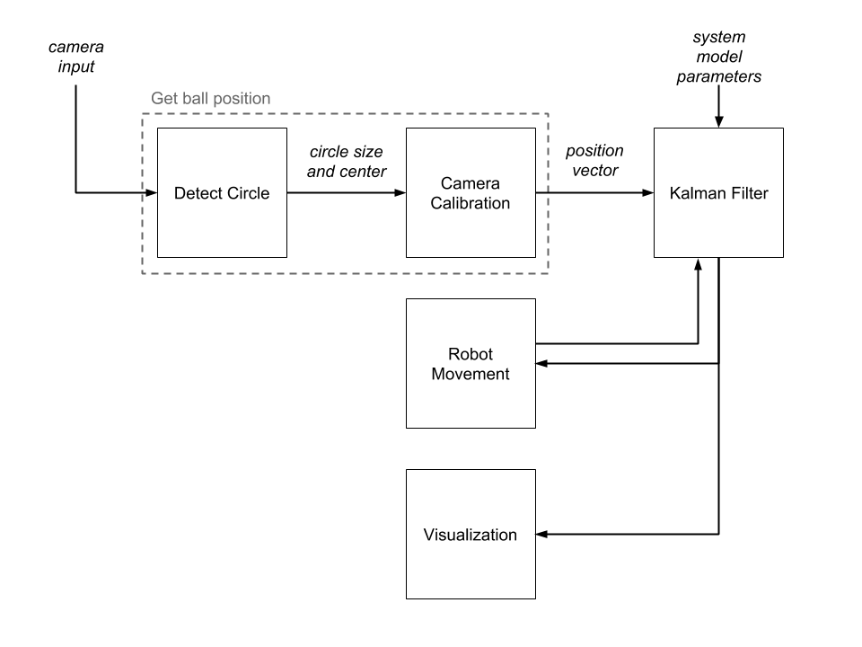
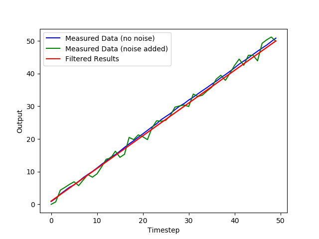
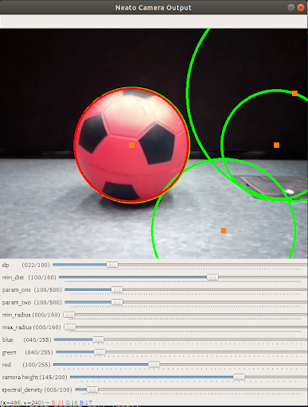
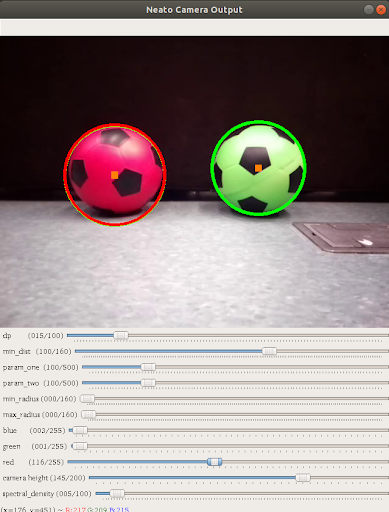
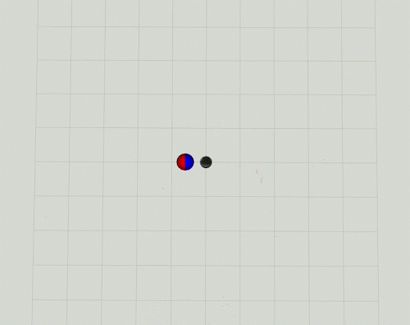
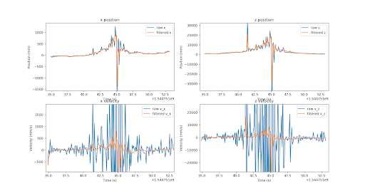
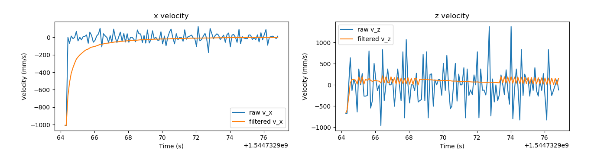

- [Home](index.md)

## Documentation
### Overview
#### What does it do?
For this project, we implemented  a Kalman filter to improve a simple computer vision algorithm with the goal of making a Neato follow around a soccer ball.

*The Neato estimates where the ball is and keeps it a fixed distance away.*

A general block diagram of the process can be seen below. First, the position of the ball is obtained by detecting circles in video frames, identifying the circle most likely to be the ball, and translating its location in pixels to a position vector relative to the robot using camera calibration. This measured position is then input into the Kalman filter, which produces a filtered, and ideally more accurate, estimate of the ball’s position using a predictive model along with the input data. Finally, proportional control is used to direct the robot to approach or retreat from the ball to maintain a given distance. The motor controls given to the robot are also input into the Kalman filter for a more robust predictive model.

### What is a Kalman Filter?

Because of imperfect sensors, noise affects measurements in many systems and obscures the overall behavior over time. In such systems, Kalman filters provide a method to more accurately estimate how the state of the system behaves over time. Kalman filters keep track of an estimate for the system’s true state and a variance of this estimate, which it uses, along with the actual measurement, to update it’s estimated state at the next time step. To do so, these filters first use a state transition model on the current estimate’s probability distribution to determine a prediction for the state of the system. This prediction is then weighted together with the actual measurement to determine the next estimate of the system state.

We found that [this book](https://github.com/rlabbe/Kalman-and-Bayesian-Filters-in-Python) provides a thorough introduction to the mathematics behind Kalman filters and their implementation.

### System Architecture

#### General Filter

To implement a working filter for this project, we first implemented a Python class for a general multivariate Kalman filter. Because we designed this class to be general, we are able to specify details about the system such as the number of variables. This allowed us to build up complexity throughout our project by first testing on less complex systems. For example, we first tested our filter on a system with measurements defined by f(t)=t, with noise added into each measurement. We found that our filter worked very well on this system, the results of which are shown in the plot below. 

#### Camera Calibration

To convert data from the Neato’s camera feed into real-world measurements, we first needed to measure values intrinsic to our system’s camera, namely focal distance and image center, through performing a camera calibration. To quickly perform a camera calibration, we used the [ros camera calibration package](http://wiki.ros.org/camera_calibration). With this package, we took photos of a checkered paper at different depths, heights, and angles. The package then calculated the focal length and image center of our camera.

Once we had the system’s focal distance and image center, we were able to mathematically translate locations of pixels into their real-world counterparts. We did these calculations in the Camera Calibrator class. To be able to determine depth, we relied on a very important constraint of our system as we had designed it: the ball would always be on the floor. Using the radius of the ball in pixels and the pixel at which the ball’s center is located, we determined the point at which the ball interfaced with the ground. Because we also knew the height of the Neato’s camera, we could then geometrically calculate the depth of the ball from the Neato. Knowing the depth then allowed us to figure out the horizontal distance of the ball from the camera as well.

#### Computer Vision

In order to focus on the Kalman filter, we kept the ball identification algorithm simple. To find the soccer ball, we used OpenCV’s HoughCircles algorithm: . This algorithm gave us all detected circles in a camera frame. To make our best guess of which circle was the soccer ball, we found the average pixel values inside the circle and picked the circle with average pixel values that were all above given thresholds. 

*Sample output of the computer vision algorithm. The green circles represent all circles identified by the HoughCircles algorithm. The red circle around the ball indicates that the algorithm has identified it as the most likely candidate to be the soccer ball out of the found circles. All of the algorithm parameters and thresholds can be tuned and updated while the program is running to allow flexibility in lighting conditions and ball colors.*

This algorithm is prone to error because the thresholds depend on the lighting in the room. It also does not do well when the soccer ball is in a location with a lot of objects in the background. The best performance of the algorithm is when the ball is placed in front of a plain, dark background.

*The algorithm uses the average pixel values to select the most likely ball. In this case, the red soccer ball is correctly identified as the target, while the green ball is ignored.*

In order to make the algorithm more flexible to different lighting conditions, we created slider bars to adjust the parameters as the system was running. In this way, we could tune for the given conditions and more successfully identify the ball.

*The algorithm performs much worse in an environment with other objects and light walls.*

### Results

#### Demo

To validate the estimated location of the ball calculated by our Kalman Filter, we implemented three different ways to compare its behavior compared to that of the measurement.

1. Plot each estimated state variable and it’s real measurement counterpart over time
2. Visualize the estimated and measured ball location relative to the Neato in RViz 
3. Display the estimated ball location on the Neato camera feed to compare it to the detected ball position

Below, we include results of different tests using our filter to track a ball’s movement represented through these different forms.

*In this RViz visualization, the red sphere corresponds to the measured ball location while the blue sphere corresponds to the filter’s estimate. When this first begins, the estimate is so close to the real measurement value that the spheres heavily overlap. The ball then begins to move away from the Neato, which the filter is slightly delayed in tracking because it is predicting that the ball’s velocity will remain at zero. Noticeably, there was a fair amount of noise in the measurements as the ball moved away from the Neato. This can be seen by the jerking about of the red sphere, while the blue sphere has a somewhat smoother movement. The spheres then move off screen as the ball moves too far to be shown in RViz before moving back towards the Neato.*

*In this gif, the red circle corresponds to the measured ball location while the blue circle corresponds to the estimated location from the filter. The video feed is taken from the Neato trying to maintain a fixed distance from the stationary soccer ball. Note that a lot of noise is introduced by the Neato sending frames of video that do not contain useful data. The filtered data quickly catches up to the measured location after instances of the video cutting out, but this results in the Neato moving to accommodate perceived changes in the ball’s position.*

*In this gif, the red circle corresponds to the measured ball location while the blue circle corresponds to the estimated location of the filter. Note that when the ball is stopped from moving forward anymore, the blue circle continues to move forward because the filter predicts that the ball will continue travelling at its current velocity. The blue circle then begins to move backwards because the filter corrects itself when its prediction of the system’s state differs too heavily from the measurement. The blue circle then tracks the measured red circle fairly well as it moves away from the camera. *

*In this test of our system, one of our measured values (at ~t=45) was a very large outlier, which highlights some interesting behaviors of our system. Although these outliers are cut off in the graph because they were so extreme, the x-position shot down to -4,000 and the z-position shot down to -45,000. Because these were such extreme jumps, our filter did not update its state to follow these predictions very heavily. However, we did see a spike at these points because we wanted our filter to be somewhat susceptible to large changes, such as when the ball starts moving from a still position. This plot also demonstrates the smoothing nature of our filter at the beginning and end of the measured time steps.*

*In the plot above, the smoothing of a very noisy velocity curve is very apparent. Because of the noise inherent to the system, the measured velocity was often extremely off from reasonable values. So, we made sure that our filter was not very susceptible to large spikes in velocity data. This is in contrast to the design of our positional state updates, which was less prone to random spikes because of noise.*

### Lessons Learned

Fully understanding the mathematics behind Kalman Filters before implementation allowed us to debug our system much more easily. For example, we found that when applying our filter to a video of a stationary ball, our filter’s predicted state of the ball would approach the measured value but remain offset by too large of an amount. We diagnosed this issue as a problem with the Kalman gain, which acts as a ratio between 0 and 1. A low Kalman gain means that more of the filter’s predicted state will be taken into account to determine the updated state, while a high value means that more of the measurement would be taken into account to determine the updated state. Since we noticed that our filter’s updated state was not straying far from it’s predictions, leading to it getting stuck in place, we were able to realize that this behavior stemmed from a very low Kalman gain. From here, we were able to examine the different components of the equation to determine the Kalman gain, which led to our realization that our measurement covariance was too high. Testing this theory confirmed that lowering the filter’s measurement covariance in turn raised the Kalman gain, which allowed our filter to more accurately weight the measurement with its prediction in calculating its updated state. Spending a large chunk of the project researching and learning about Kalman filters paid off greatly in moments like these during our implementation. Especially in implementing a complex mathematical system such as this filter, are often many  variables to fine-tune and issues to debug, so a solid understanding of the theory proves invaluable.
