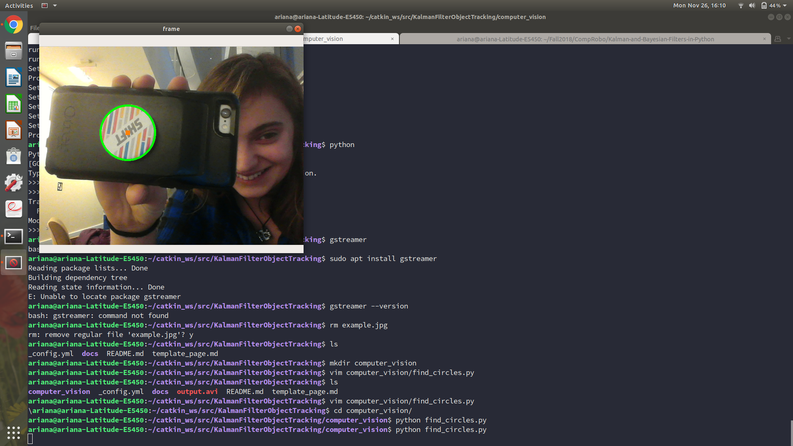

- [Home](index.md)

## Story One - Getting Started
When we began this project, our main interest was in exploring the mathematics behind and applications of Kalman filters. Based on this goal decided our specific application: tracking a ball detected by the Neato using OpenCV. Since we wanted to keep our project rooted in the exploration of Kalman filters, we began learning about and researching Kalman filters while implementing the ball detection in parallel. 

### Computer Vision
We are using the [Hough Circles algorithm](https://docs.opencv.org/2.4/modules/imgproc/doc/feature_detection.html?highlight=houghcircles#houghcircles) provided by OpenCV to detect circles in a video. This algorithm has the advantages of being easy to use and integrate with our programs. So far, we are able to detect the size and center of circles in an image or video frame and mark the detected circles on the video display (See below for an example). The parameters for this algorithm still need to be tuned in order to detect a ball in the comprobo room more accurately. Currently the algorithm finds false positives for circles in the video very often. We also need to come up with a scheme for finding the most likely circle out of all detected circles in a frame. Some potential strategies for this are to throw out potential circles that are not the correct color (working with a bright green ball will make this a lot easier), using the circle that is closest in position to the last detected circle, or randomly choosing one circle and hoping for the best. After seeing how noisey the circle detection data is by itself, it’s clear why Kalman filters are useful in computer vision.

### Camera Callibration
To be able to detect the location of an object relative to the neato using camera data, we also needed a way to infer object distance from an image. To accomplish this, we needed to perform a camera calibration with the Raspberry Pi camera, which gave us its focal distance and image center. To make this process easier, we used the [ros camera calibration package](http://wiki.ros.org/camera_calibration), which provided reasonable values for the camera’s focal length and image center. With these values, we will be able to use the *x* and *y* coordinates of the detected ball in the image to calculate the distance of the ball from the camera. 

### Next Steps
Our main focus for the upcoming week is to implement a class for a  general Kalman filter since we have spent time researching their mathematics and theory. Also, now that we are able to detect a ball with OpenCV and convert image coordinates within into values relative to the camera, we need to connect these two classes so we can find the coordinates of a ball relative to the neato. We will also test this with an actual soccer ball, which will likely require tuning the parameters of the ball detection algorithm. 
