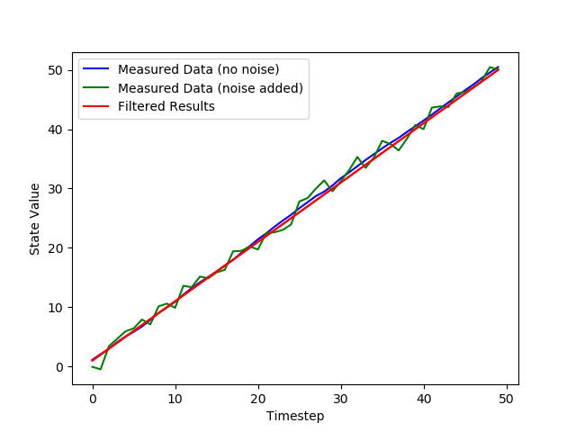

- [Home](index.md)

## Story Two - General Kalman Filter
A key feature that we implemented this week was the general Kalman filter class (highlighted in red in the block diagram below). This class is meant to be used to set up any multidimensional Kalman filter by initializing it with the right values. This algorithm for this filter was based of of the equations in Chapter 6 of Kalman and Bayesian Filters in Python (found [here](https://github.com/rlabbe/Kalman-and-Bayesian-Filters-in-Python/blob/master/06-Multivariate-Kalman-Filters.ipynb))

All basic Kalman filters can be created using parameters in the form of matrices and vectors, so our general filter is initialized with a set of matrices and parameters that represent these values. We will use this class in our final implementation with the parameters we have chosen to define ou system and make predictions about it. We anticipate it to be challenging to create a good model of our system. 

In the book, the steps for implementing a multivariate Kalman filter are listed as initialization, predict, and update. We have summarized these three steps below:

**Initialization**

This step exists so that the state of the system (i.e. the position of the ball) and values for the filter’s calculations are initialized.

**Predict**

During the predict step, we first predict the state at the next time step by multiplying the current state by a state transition function matrix, giving us the prior for the next time step. We then adjust the state covariance as well using the state transition matrix, which allows us to better account for how our uncertainty in the state changes over time. 

**Update**

In the update step of the filter, measurements and the expected noise of the measurements are given to the filter. The filter takes a point between the prediction and measurement scaled by the Kalman gain as the new state. The Kalman gain is calculated using the belief in the estimation and the prediction. The estimation will be closer in value to the point with the greater belief. The belief in the new state is calculated using these beliefs as well and is updated for the next iteration.

*The figure above demonstrates one iteration of the Kalman filter. It is taken from chapter 6 of Kalman and Bayesian Filters in Python.*

To test our general filter, we created fake measurement data, which corresponded to a linear function with noise added at each time step. We then compared our filter’s prediction of the results with the original function without noise. A plot of our filter working with this example data is shown for an initial measurement function with slope 1. As can be seen, our filter’s predicted results closely match the actual measurement data without noise. 
